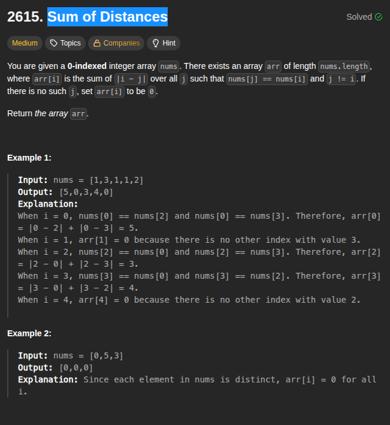

## Sum of Distances

When nothing is clicking, go to brute and see if some formula is forming or what is repeating.

### Solution

```cpp
class Solution {
public:
    vector<long long> distance(vector<int>& nums) {
        int n = nums.size();
        unordered_map<int, vector<int>> groups;

        // Step 1: group indices by value
        for (int i = 0; i < n; i++) {
            groups[nums[i]].push_back(i);
        }

        vector<long long> ans(n, 0);

        // Step 2: process each group with prefix sums
        for (auto &kv : groups) {
            auto &indices = kv.second;
            // sort(indices.begin(), indices.end());

            int m = indices.size();
            vector<long long> prefix(m, 0);
            prefix[0] = indices[0];
            for (int i = 1; i < m; i++) {
                prefix[i] = prefix[i-1] + indices[i];
            }

            long long totalSum = prefix[m-1];

            for (int i = 0; i < m; i++) {
                long long idx = indices[i];
                long long leftCount = i;
                long long leftSum = (i > 0 ? prefix[i-1] : 0);
                long long rightCount = m - i - 1;
                long long rightSum = totalSum - prefix[i];

                long long dist = leftCount * idx - leftSum
                               + rightSum - rightCount * idx;

                ans[idx] = dist;
            }
        }

        return ans;
    }
};
```
